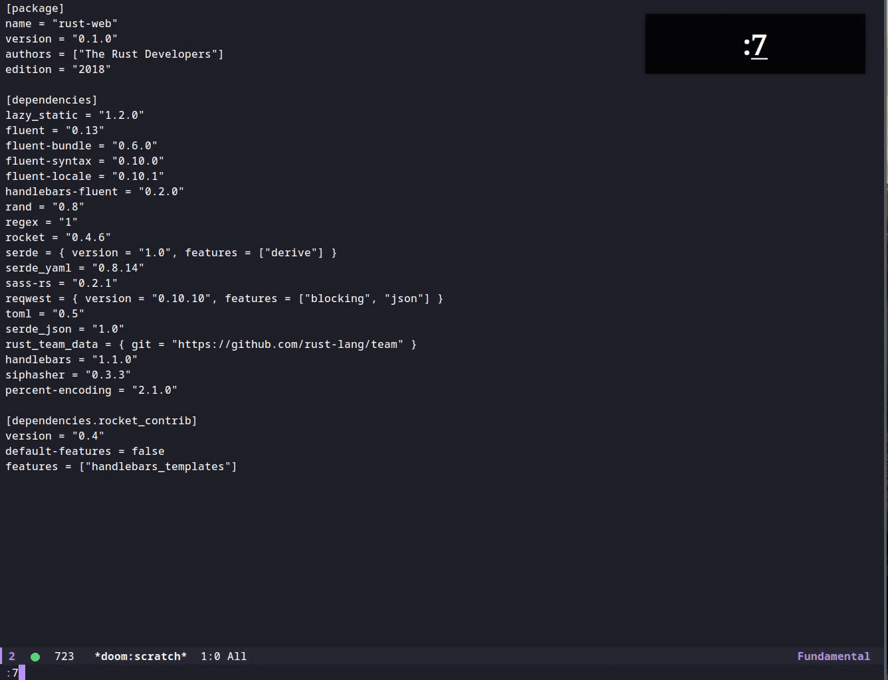

# kak.el

An attempt to port [Kakoune](https://github.com/mawww/kakoune)'s multiple selections into [Emacs](https://www.gnu.org/software/emacs/).

This package provides functions that simulate Kakoune's multiple selection commands.
It's built on top of [`evil-mc`](https://github.com/gabesoft/evil-mc)'s multiple cursors and [`evil`](https://github.com/emacs-evil/evil)'s functions.

## Functions

The package's main functions:

### Visual mode only functions

- `|` (Kakoune) - `kak-exec-shell-command (command)` (Emacs): execute a shell command using each cursor's region as the standard input and replace the region with the standard output.
- `s/S` (Kakoune) - `kak-select (beg end invert)` (Emacs): split/select a given region into multiple matching regions. `invert` determines whether the command should do a split.
- `M-s` (Kakoune) - `kak-split-lines (beg end)` (Emacs): split a given region into multiple lines. There will be a cursor each line.
- `M-k/M-K` (Kakoune) - `kak-filter (keep)` (Emacs): filter/keep all active cursors. `keep` determines whether the command should keep the matching cursors.

### Normal/Visual mode functions

- `kak-insert-index (base)` insert an index after each cursor based on a `base` index and the cursor's position relative to other cursors.

## Demo



## Usage

To use the package after installation

```emacs-lisp
(use-package kak)
```

An example mapping using [Doom Emacs](https://github.com/hlissner/doom-emacs)'s `map!` macro:

```emacs-lisp
(map!
  :v "|" #'kak-exec-shell-command
  :v "s" (lambda (beg end) (interactive "r") (kak-select beg end nil))
  :v "S" (lambda (beg end) (interactive "r") (kak-select beg end t))
  :v "M-s" #'kak-split-lines
  :v "M-k" (lambda () (interactive) (kak-filter t))
  :v "M-K" (lambda () (interactive) (kak-filter nil))
  :v ". #" #'kak-insert-index)
```
